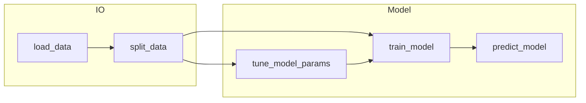

# Implementation Plan: Model pipeline modules (from `model_train_predict.ipynb`)

**Workspace**: `model_pipeline` | **Date**: 2025-03-22 | **Spec**: [spec.md](spec.md)

**Note**: 源码级实现留到 `tasks` / implement 阶段；本文件用伪代码与接口约定描述重构方案。

---

## Summary

将笔记本中的 **数据读取、时间/随机划分、模型训练（**多后端接口**，**默认且首期仅实现 LGB**：含 early stopping 与全量二次训练）、预测写盘** 抽成五个模块；**交叉验证与超参搜索** 在笔记本中仅有 `sklearn` 引用而无完整流程，按计划新增 `tune_model_params.py`，与 `train_model` 复用同一 **`model_type` 分发** 与 metric 约定。**XGB 等** 与 LGB 并列注册，后续里程碑再实现具体训练/保存/重要性逻辑。文档与对外取值统称 **LGB**；实现代码中可 `import lightgbm as lgb` 调用库 API。

---

## Technical Context

| 项目 | 值 |
|------|-----|
| **Language/Version** | Python 3.x（与当前 notebook 环境一致） |
| **Primary Dependencies** | pandas, numpy, scikit-learn, lightgbm；**xgboost** 为后续后端可选依赖 |
| **Storage** | Parquet（`pd.read_parquet` / `to_parquet`） |
| **Testing** | pytest（建议为 `split_data` / `load_data` 小样本与 mock 路径写单测）；训练模块可做 smoke test |
| **Target Platform** | 本地 / 离线批处理（与 `/data1/...` 类路径兼容） |
| **Project Type** | single（脚本 + 库模块） |
| **Performance Goals** | 与现网 notebook 行为一致；`num_threads` 等通过参数传入而非写死 |
| **Scale/Scope** | 百万级行 DataFrame；需注意 `gc.collect()` 等大内存习惯可保留在 train 路径 |
| **Constraints** | 修复笔记本 `lgb_model_train_and_save` 内在无 `val_data` 且 early stopping 时误用 `data[label]` 的 bug（应使用 `train_data[label]`） |

---

## Architecture Overview



- **load_data** 产出带业务列 + 特征列 + label 的 `DataFrame`（或分离的 `X, y` 由调用方或 `train_model` 入口约定）。
- **split_data** 只负责划分，**不**写死输出路径；笔记本中的 `to_parquet` 迁到编排层或可选参数。
- **train_model** 对外暴露统一入口（如 `train(..., model_type=...)`），**默认 `model_type` = LGB**；内部分发到 LGB 实现（首期唯一实现），日后增加 XGB 等模块。
- **tune_model_params** 依赖 **split_data** 或内置 fold 迭代，对每组超参按 **`model_type`** 调用对应训练或 `cv` API，用统一 metric 比较。

---

## Key Design Decisions

### Decision 1: 模块物理位置与包名

- **背景**: 用户指定文件名 `load_data.py` 等。
- **选项**: A) 仓库根目录平铺五个文件；B) 子目录包 `model_pipeline/` 或 `pipeline/` 下平铺五个文件。
- **结论**: 采用 **B) `model_pipeline/` 包**（根目录仅增加一个包，避免污染根目录；`python -m model_pipeline...` 或 `from model_pipeline.load_data import ...`）。
- **后果**: 需在包内加 `__init__.py`（若需）；或文档说明将 `model_pipeline` 所在父路径加入 `PYTHONPATH`。

### Decision 2: `train_model` 是否内置「全量二次训练」

- **背景**: 笔记本 `train_model_with_all_data` 先 early stopping 得 `bst_num_boost_round`，再 `concat` train+val 全量训练终模。
- **结论**: **保留为显式参数**（如 `refit_on_full_data: bool`, `boost_round_multiplier: float = 1.1`），默认行为与笔记本一致；纯单次训练路径等价于 `refit_on_full_data=False`。
- **后果**: API 略复杂，但与现有生产逻辑一致。

### Decision 3: 交叉验证实现策略

- **背景**: 笔记本未实现完整 CV；用户要求「候选超参窗口 + 基于 train/val + metric」。
- **选项**: A) LGB 原生 `cv`（实现中常为 `lightgbm.cv`）+ `param_grid` 笛卡尔积；B) sklearn `GridSearchCV` 包装 LGB；C) 自研循环 + 每组参数一次 LGB `train`。
- **结论**: **优先 A + 小网格时用 C**——时间序列场景用 LGB `cv` 的 `folds` 或自定义按时间切分；随机场景用 `StratifiedKFold` 等生成 fold。超参组合用 itertools 或显式 `list[dict]`。
- **后果**: `tune_model_params` 需接受 **metric 名称或 callable**（如 `auc` → `sklearn.metrics.roc_auc_score`），与 LGB `feval` 对齐时注意二分类标签列名。

### Decision 4: 多模型类型（`train_model` / `predict_model` / `tune_model_params`）

- **背景**: 需要支持 **LGB、XGB、未来其它**；当前只落地 LGB。
- **选项**: A) 完全独立的按后端脚本；B) **统一入口 + 注册表/策略对象**，按 `model_type` 分发。
- **结论**: **B)** — 使用枚举或等价常量（对外文档统一 **LGB** / **XGB**），`train_model.train(..., model_type: ModelType = ModelType.LGB)`；未实现类型 **显式报错**（或 `NotImplementedError`），避免静默走错后端。
- **后果**:
  - `predict_model` 需 **`model_type` 或从文件扩展名/魔术字节推断**；为减少歧义，**推荐调用方显式传入 `model_type`**，默认 **LGB**。
  - `params` 与 `importance` 格式随后端变化；`TrainResult` 可包含 `model_type` 与保存路径。
  - 首期仅实现 **LGB** 分支；XGB 里程碑需对齐：early stopping、全量 refit、特征重要性导出格式。

---

## Module Design

### Module: `load_data`

**职责**: 从给定路径加载表格数据，并解析出特征列与标签列。

**接口（伪代码）**:

```
load_dataset(path: str, *, label_column: str | None, feature_columns: list[str] | None, id_columns: list[str] | None) -> LoadedData
```

**核心流程**:

```
1. 若 path 为目录或 Hive 风格数据集，使用 pandas read_parquet 与现有 notebook 一致
2. 若 feature_columns 为 None，可用「全列减 label 与 id/metadata 列」策略，或强制调用方传入（推荐强制传入 + 可选 exclude_columns）
3. 返回 DataFrame 或 NamedTuple：(df, features, label_name)
```

> **决策**: 路径仅作参数，**禁止**在模块内写死 `/data1/...`。

---

### Module: `split_data`

**职责**: 按策略与比例划分数据。

**接口（伪代码）**:

```
split(df, *, strategy: Literal["random", "time_window", ...], ratio_or_sizes: ..., config: SplitConfig) -> tuple[DataFrame, DataFrame]
# 可选：train / val / test 三分
```

**核心流程**:

```
strategy == "time_window":
  1. 读取 config.date_column, config.train_start, config.train_end（及可选 val 段）
  2. 布尔过滤 df，得到 train_df；val 可为时间下一段或剩余集

strategy == "random":
  1. 调用 sklearn train_test_split，test_size / train_size 来自 ratio
  2. 可选 stratify=df[label]

strategy == "group" (可选扩展):
  使用 GroupShuffleSplit / 按 trace_id 去重后再划分（若业务需要）
```

> **决策**: 与 **train_model** 内的临时 `train_test_split` 脱钩：early stopping 的内部分割若仍存在，应调用 **split_data** 的 random 策略或传入已划分好的 val。

---

### Module: `train_model`

**职责**: 按 **`model_type`（默认 LGB）** 训练、保存模型与特征重要性；对内可拆为 `_train_lgb(...)`（LGB 后端实现，函数名仅为代码习惯）、未来 `_train_xgb(...)`。

**接口（伪代码）**:

```
train(train_df, val_df | None, features, label, params, *,
      model_type: ModelType = LGB,
      model_path, importance_path, is_early_stopping, num_boost_round, callbacks_config,
      refit_on_full_data, boost_round_multiplier) -> TrainResult

# 内部（首期实现）
_train_lgb(...) -> TrainResult
# 占位，后续里程碑
_train_xgb(...) -> NotImplementedError | TrainResult
```

**核心流程（分发层）**:

```
1. 根据 model_type 选择后端实现
2. 若为 LGB：执行下列 LGB 专用流程
3. 若为其它且未实现：raise 明确错误
```

**核心流程（LGB 实现，与笔记本一致）**:

```
1. 若 val_df 非 None：lgtrain, lgval；callbacks 含 early_stopping（若 is_early_stopping）
2. 若 val_df 为 None 且 is_early_stopping：调用 split_data.random 得到内部 val（比例、random_state 可配置）
3. 若 val_df 为 None 且非 early_stopping：单 Dataset，无 early_stopping callback
4. LGB：`train`（实现中通常为 `lightgbm.train`，见 `spec.md` 术语表）
5. save_model(path)；feature_importance(gain) → CSV
6. 若 refit_on_full_data：读取 mid 模型树棵数 × multiplier 作为新 num_boost_round；concat(train,val)；再次 train 且关闭 early stopping
```

> **决策**: `log_evaluation(period=...)`、`early_stopping(stopping_rounds=...)` 从魔法数字改为 **默认常量 + 参数覆盖**。

---

### Module: `predict_model`

**职责**: 加载模型并对特征矩阵打分；**按 `model_type` 选择加载器**（默认 LGB）。

**接口（伪代码）**:

```
predict_scores(model_path | NativeBooster, predict_df, *,
               model_type: ModelType = LGB,
               feature_order: list[str] | None, num_threads: int | None) -> ndarray | Series

predict_and_save_parquet(..., model_type: ModelType = LGB, id_column, score_column, output_path) -> None
```

**核心流程**:

```
1. model_type == LGB：`Booster(model_file=path)`（实现中为 `lightgbm.Booster`）
2. model_type == XGB（未来）：对应 XGBoost 加载 API
3. 特征列 = 模型对象提供的列名 若 feature_order 为 None
4. 调用对应 predict API
5. 若需要写盘：仅写 id + score（与 get_all_data_train_prediction 对齐）
```

---

### Module: `tune_model_params`

**职责**: 生成超参候选集并在 train（+ validation / folds）上评估（实现上常用交叉验证）。

**接口（伪代码）**:

```
build_param_grid(model_type: ModelType, grid_spec: dict[str, list | tuple]) -> Iterator[dict]
# 不同后端的 grid_spec 键名可能不同（如 LGB 的 num_leaves vs XGB 的 max_depth），由调用方按文档传入

tune(train_df, *, model_type: ModelType = LGB, label, features, param_grid, metric: str | Callable, n_splits, split_strategy, ...) -> TuningReport
```

**核心流程**:

```
1. build_param_grid：对每组离散列表做笛卡尔积；连续「窗口」可用 np.linspace 生成序列再离散化（可按 model_type 做键校验）
2. 对每个 param_dict：
   a. 若 n_splits>1：按 split_strategy 生成 fold；每 fold 上调用 train_model 的轻量训练或后端原生 cv（LGB：`lightgbm.cv` 等）
   b. 若用户提供固定 val：单折等价于一次验证集评估
3. 返回最优参数 + 全表结果 DataFrame（参数列 + metric_mean + metric_std）
```

> **决策**: **首期仅实现 `model_type=LGB` 的 CV 循环**；`model_type` 与 `train_model` 共用同一枚举/注册表，XGB 后续接入时复用本模块入口（如 `tune`）的外壳。

---

## Project Structure

### Documentation（本功能）

```text
specs/model_pipeline/
├── spec.md
├── plan.md
└── tasks.md          # 任务清单（与实现以 tasks 为准，见下）
```

### Source Code（建议）

```text
model_pipeline/
├── __init__.py           # 可选：导出主要 API
├── load_data.py
├── split_data.py
├── train_model.py        # 入口 + 分发；可内联或引用 backends/
├── predict_model.py
├── tune_model_params.py
├── metrics.py            # 可选：统一 auc / 自定义 feval 注册
└── backends/             # 可选：首期可空，仅 LGB 留在 train_model.py；扩展时拆出 lgb.py、xgboost.py
```

**Structure Decision**: 单包承载五模块，notebook 通过 `sys.path` 或 pip editable 安装引用；与现有 `sys.path.append('/data1/...')` 解耦。**本阶段不增加单独 `types.py`**：`ModelType` / `TrainResult` / `TuningReport` 等与 **`tasks.md` Phase 2** 一致（置于 `train_model.py` 等）；若日后拆分文件，以重构任务为准。

**与 tasks 的关系**: 实现范围、Phase 顺序与验收以 **`tasks.md` 为执行源**；`plan.md` 为设计与伪代码，不替代 tasks 中的具体任务条目。

---

## Design Artifacts

| 产物 | 本 run |
|------|--------|
| research.md | 不生成（无 NEEDS CLARIFICATION） |
| data-model.md | 不生成（无持久化 schema 变更） |
| contracts/openapi.yaml | N/A |
| quickstart.md | 可选后续补充「一条命令训练」示例 |

---

## Notes

- **笔记本迁移顺序**: 先 `load_data` + `split_data` 替换读取与 `train_test_split` 单元格；再替换训练与预测函数调用；最后接入 `tune_model_params`。
- **风险**: 全量数据内存峰值与多进程 `num_threads`；默认线程数应可配置。
- **待确认**: 是否需要 **三分法**（train/val/test）与 **仅 OOT 时间外推** 作为 `split_data` 的一等策略；可在 `tasks` 阶段用最小实现 + 后续迭代。
- **多后端**: 默认 **`model_type` = LGB**；选择非 LGB 且未实现时 **fail fast**，避免误用参数名（LGB vs XGB）导致难查问题。

---

## 建议下一步

按 **`tasks.md`** 中的 Phase 顺序实现；每 Phase 结束运行 `pytest` 与覆盖率 gate，并在小数据上做 smoke test。若需求变更，先改 `spec.md` / `plan.md`，再同步更新 `tasks.md`。
